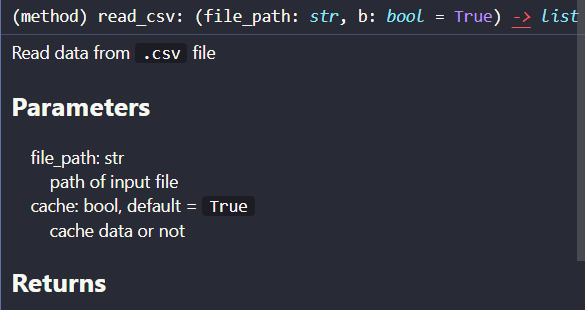

## Comment format
+ Example:

```python
class Example:
    """
    <explain the use of this class>
    """

    def read_csv(self: Example, file_path: str, cache: bool = True) -> list:
        """
        <explain use of function>

        Parameters
        ----------
            file_path: str
                path of input file
            cache: bool, default = `True`
                cache data or not

        Returns
        -------
            data: list
                data read from file
        """

        <start coding here>
```

+ comment shown in vscode:
<div align="center">
    
</div><br>

+ this comment format is numpy's format